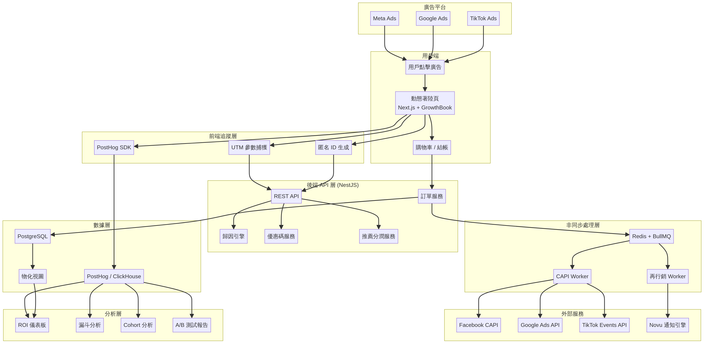

> **TL;DR**: 本文件設計了一套「從底層架構就為廣告投放優化」的 SMM Panel 電商系統，核心技術棧為 Next.js + NestJS + PostgreSQL + Redis/BullMQ + PostHog + GrowthBook。系統實作匿名身份解析、多觸點歸因、Meta/Google/TikTok 伺服器端 CAPI 回傳、動態著陸頁、棄單再行銷與推薦分潤。22 個 GitHub 開源專案評估結果：PostHog（★★★★★）、Novu（★★★★★）、GrowthBook（★★★★★）為最高推薦。

# 廣告友善型電商系統架構

> **作者**：Manus AI
> **日期**：2026 年 3 月 29 日
> **版本**：v1.0

---

## 一、背景與目標

我們正在建置一個 SMM Panel（社群行銷服務平台），銷售社群媒體的粉絲、讚、觀看等服務。本系統的核心特色在於——從底層架構就為廣告投放優化而設計，而非事後加掛追蹤像素。整個系統天生就是「廣告友善」的。

目標客戶為台灣的「小白用戶」，他們從 Facebook、Google 或 TikTok 廣告點擊進入後，不需要註冊就能直接下單購買。因此，系統必須具備以下五項核心能力：

| 核心能力 | 說明 |
| :--- | :--- |
| **全鏈路追蹤** | 每個用戶從哪個廣告來的，全程追蹤到他買了什麼、花了多少。 |
| **伺服器端轉換回傳** | 自動回傳真實購買數據給 Meta / Google / TikTok，讓廣告系統越投越準。 |
| **動態著陸頁** | 不同廣告渠道進來的用戶，自動看到不同的著陸頁、價格與優惠。 |
| **自動化再行銷** | 棄單自動觸發 Email / SMS / LINE 再行銷流程。 |
| **推薦分潤整合** | 推薦連結、優惠碼、會員等級全部打通，形成完整的增長飛輪。 |

---

## 二、GitHub 開源專案搜尋與評估

針對系統所需的各項核心功能，我們在 GitHub 上進行了深入的開源專案搜尋與評估。以下依功能領域分類，列出所有推薦的開源專案，並附上適用性分析與整合建議。

### 2.1 歸因系統（Attribution）

在歸因系統方面，開源社群提供了數個值得參考的專案。**eeghor/mta** [1] 是一個擁有 127 顆星的 Python 函式庫，專注於行銷分析中的多觸點歸因（Multi-touch Attribution）模型。它支援 First Click、Last Click、Linear 及 Time Decay 等主流歸因模型，適合做為後端數據分析引擎的核心組件。將其部署為獨立的分析微服務，定期從事件資料庫讀取用戶路徑數據，計算各渠道的歸因權重後寫回核心資料庫，是最佳的整合方式。

**rittmananalytics/ra_attribution** [2] 則是一個基於 dbt 的多週期、多觸點行銷歸因模型套件，擁有 34 顆星。若系統採用現代數據棧（Modern Data Stack）架構，結合資料倉儲（如 ClickHouse 或 PostgreSQL），透過 dbt 定期執行 SQL 轉換生成歸因分析寬表，這將是一個極佳的選擇。此外，**AjNavneet/MultiTouch-Attribution** [3] 提供了完整的 Jupyter Notebook 教學，包含歸因模型與預算優化的實作範例，非常適合團隊學習與原型開發。

### 2.2 轉換追蹤（Conversion Tracking）

轉換追蹤是廣告友善型系統的命脈。**Snowplow** [4] 是一個企業級的開源事件收集與行為數據基礎設施，擁有約 7,000 顆星，採用 Scala 與 JavaScript 技術棧。它支援客戶端與伺服器端追蹤，能建立第一方的數據收集管道，避免被瀏覽器阻擋，非常適合需要精確且不漏失事件的電商系統。**Jitsu** [5] 則是另一個強大的開源 Segment 替代品，擁有約 4,500 顆星，採用 Go 與 TypeScript 技術棧，提供事件收集與路由引擎。

在廣告平台 API 整合方面，**facebookincubator/ConversionsAPI-Tag-for-GoogleTagManager** [6] 是 Facebook 官方提供的 GTM Server-Side 標籤，擁有 77 顆星。若團隊熟悉 Google Tag Manager，這是最快實現 Facebook CAPI 的官方解決方案。**stape-io/facebook-tag** [7] 則是社群維護的版本，擁有 48 顆星，提供了更多的自訂選項。此外，**stape-io/gads-offline-conversion-tag** [8] 專門處理 Google Ads 的離線轉換追蹤。

### 2.3 再行銷引擎（Retargeting & Marketing Automation）

對於再行銷引擎，**Mautic** [9] 是全球最大的開源行銷自動化平台，擁有約 7,500 顆星，採用 PHP 與 MySQL 技術棧。它支援電子郵件行銷、潛在客戶管理與複雜的自動化工作流程，可完全替代 Braze 或 ActiveCampaign，適合建立棄單提醒與後續的再行銷旅程。透過 API 將「加入購物車」與「結帳」事件同步至 Mautic，並在其中設定 30 分鐘未購買即觸發 Email/SMS 的自動化流程，是最直接的整合方式。

若只需要單純的觸發式通知（如棄單提醒、購買成功通知），**Novu** [10] 是一個極佳的選擇。它擁有高達 38.7k 顆星，提供統一的 API 來發送 Email、SMS、Push 與 Chat 通知，比 Mautic 更輕量且易於與現代 Node.js 後端整合。**Laudspeaker** [11] 則是另一個開源的客戶互動平台，擁有 2.6k 顆星，定位為 Customer.io 的開源替代方案，支援基於用戶行為的自動化旅程。

### 2.4 A/B 測試框架

**GrowthBook** [12] 是一個開源的 Feature Flag 與 A/B 測試平台，擁有 7.4k 顆星，採用 TypeScript、React 與 MongoDB 技術棧。它內建強大的統計引擎（支援 Bayesian 與 Frequentist 方法）與產品分析功能，完美契合動態著陸頁與 A/B 測試的需求。前端整合 GrowthBook SDK，根據用戶的匿名 ID 獲取分配的變體，並將實驗曝光事件發送至數據庫，是推薦的整合方式。

**Unleash** [13] 是另一個企業級的 Feature Flag 管理平台，擁有約 12k 顆星，採用 TypeScript 與 Node.js 技術棧。它專注於功能開關，若主要需求是根據 UTM 參數動態切換頁面內容，這是一個穩定且受歡迎的選擇。透過前端或後端 SDK 評估功能開關狀態，即可決定顯示哪種著陸頁版本。

### 2.5 推薦分潤系統（Affiliate / Referral）

在推薦分潤系統方面，開源方案相對較少且成熟度不高，但仍有數個值得參考的專案。**Refferq** [14] 是一個現代化的聯盟行銷平台，擁有 43 顆星，採用 Next.js、PostgreSQL 與 Prisma 技術棧。它提供完整的聯盟會員門戶、實時分析、彈性佣金規則與白標定制，其技術棧非常適合與我們的新系統整合。

**WeferralHq/weferral** [15] 擁有 278 顆星，採用 Node.js、React 與 PostgreSQL 技術棧，是一個推薦管理軟體，支援推薦連結生成與佣金追蹤。**amicalhq/refref** [16] 擁有 158 顆星，同樣採用 Next.js 與 TypeScript 技術棧，提供推薦和聯盟行銷平台的核心功能。由於此領域的開源方案尚不成熟，建議參考上述專案的架構設計，在系統中自建一個輕量級的推薦分潤微服務。

### 2.6 分析儀表板（Analytics Dashboard）

分析儀表板的首選是 **PostHog** [17]，這是一個全方位的產品分析平台，擁有高達 32.3k 顆星，採用 Python、TypeScript 與 ClickHouse 技術棧。它包含事件追蹤、漏斗分析、Session Replay、Feature Flag 與 A/B 測試。PostHog 幾乎涵蓋了我們對分析、追蹤與 A/B 測試的所有需求，是系統數據大腦的最佳選擇。前端安裝 PostHog SDK 進行自動捕獲與自訂事件追蹤，後端透過 API 發送伺服器端事件，利用其內建的漏斗與儀表板功能追蹤廣告 ROI，是推薦的整合方式。

**Plausible Analytics** [18] 擁有約 24.5k 顆星，採用 Elixir 與 ClickHouse 技術棧，是一個輕量級、注重隱私的網站分析工具，不使用 Cookie。若希望提供極致的加載速度且不依賴複雜的 Cookie 橫幅，這是一個很好的 GA 替代品。**Umami** [19] 擁有約 35.9k 顆星，採用 TypeScript 與 Next.js 技術棧，同樣是一個注重隱私的網站分析工具。**Openpanel** [20] 擁有 5.6k 顆星，採用 Next.js 與 ClickHouse 技術棧，是一個新興的產品分析平台。

### 2.7 動態定價與著陸頁

在動態定價與著陸頁方面，開源方案較為罕見，大多數電商系統選擇自建。**CouponZo** [21] 是一個無頭（Headless）促銷引擎，採用 React、Node.js 與 MongoDB 技術棧，支援生成靜態或動態優惠券。雖然目前社群活躍度不高，但可作為實作動態優惠碼系統的參考架構。**Sylius/Promotion** [22] 是 Sylius 電商框架中的促銷引擎組件，採用 PHP 技術棧，提供了成熟的促銷規則引擎設計模式，值得在架構設計時參考。

### 2.8 開源專案彙總表

以下表格彙總了所有推薦的開源專案，按功能領域分類：

| 領域 | 專案名稱 | Star 數 | 技術棧 | 推薦程度 | 整合建議 |
| :--- | :--- | ---: | :--- | :---: | :--- |
| 歸因系統 | eeghor/mta | 127 | Python | ★★★ | 部署為分析微服務 |
| 歸因系統 | ra_attribution | 34 | dbt / SQL | ★★★ | 結合資料倉儲使用 |
| 歸因系統 | MultiTouch-Attribution | 14 | Python / Jupyter | ★★ | 學習與原型開發 |
| 轉換追蹤 | Snowplow | ~7k | Scala / JS | ★★★★ | 事件收集管道 |
| 轉換追蹤 | Jitsu | ~4.5k | Go / TypeScript | ★★★★ | Segment 替代品 |
| 轉換追蹤 | FB CAPI GTM Tag | 77 | JavaScript | ★★★ | GTM Server-Side |
| 轉換追蹤 | stape-io/facebook-tag | 48 | JavaScript | ★★★ | GTM Server-Side |
| 再行銷 | Mautic | ~7.5k | PHP / MySQL | ★★★★ | 行銷自動化平台 |
| 再行銷 | Novu | 38.7k | TypeScript | ★★★★★ | 通知基礎設施 |
| 再行銷 | Laudspeaker | 2.6k | TypeScript | ★★★ | 客戶互動平台 |
| A/B 測試 | GrowthBook | 7.4k | TypeScript | ★★★★★ | Feature Flag + A/B |
| A/B 測試 | Unleash | ~12k | TypeScript | ★★★★ | Feature Flag 管理 |
| 推薦分潤 | Refferq | 43 | Next.js / PG | ★★★ | 聯盟行銷平台 |
| 推薦分潤 | Weferral | 278 | Node.js / PG | ★★★ | 推薦管理軟體 |
| 推薦分潤 | Refref | 158 | Next.js / TS | ★★★ | 推薦追蹤平台 |
| 分析儀表板 | PostHog | 32.3k | Python / TS | ★★★★★ | 全方位產品分析 |
| 分析儀表板 | Plausible | ~24.5k | Elixir | ★★★★ | 輕量級網站分析 |
| 分析儀表板 | Umami | ~35.9k | TypeScript | ★★★★ | 隱私友善分析 |
| 分析儀表板 | Openpanel | 5.6k | Next.js | ★★★ | 新興產品分析 |
| 動態定價 | CouponZo | - | React / Node.js | ★★ | 優惠碼引擎參考 |
| 動態定價 | Sylius/Promotion | - | PHP | ★★ | 促銷規則引擎參考 |

---

## 三、系統架構設計

基於上述開源專案的評估與現代電商最佳實踐，以下是 SMM Panel 的完整「廣告友善型」技術架構設計。整體架構分為十個核心模組，每個模組都從廣告投放優化的角度進行設計。

#### 系統架構總覽



### 3.1 全鏈路用戶追蹤

#### 設計理念

為了在「免註冊」的情境下實現精準追蹤，系統採用**匿名身份解析（Anonymous Identity Resolution）**策略。這套策略的核心思想是：即使用戶從未登入或註冊，系統仍能透過多層識別機制，將同一個人在不同時間、不同設備上的行為串聯起來。

#### 前端追蹤機制

當用戶點擊廣告進入著陸頁時，前端系統（建議整合 PostHog SDK）會立即執行以下操作。首先，生成一個唯一的匿名設備 ID（UUID v4），並將其同時寫入 HttpOnly Cookie 與 LocalStorage 中，以確保跨工作階段的持久性。其次，自動解析 URL 中的所有追蹤參數，包括標準 UTM 參數（`utm_source`、`utm_medium`、`utm_campaign`、`utm_term`、`utm_content`）以及廣告平台特有的 Click ID（Facebook 的 `fbclid`、Google 的 `gclid`、TikTok 的 `ttclid`）。這些參數會與匿名 ID 綁定，並作為首次觸點（First Touch）記錄在事件資料庫中。

#### 跨設備追蹤策略

在跨設備追蹤方面，系統採用「漸進式身份合併」策略。當用戶在結帳時提供了 Email 或手機號碼，後端會檢查該聯絡資訊是否已與其他匿名 ID 關聯。若是，則將多個匿名 ID 合併為單一用戶實體，並回溯更新所有歷史事件的歸屬關係。這種機制確保了即使用戶在手機上看到廣告、在電腦上完成購買，系統仍能正確歸因。

### 3.2 歸因引擎

#### 多觸點歸因模型

歸因引擎負責準確評估各廣告渠道的真實貢獻。系統支援以下五種歸因模型，行銷團隊可根據業務需求靈活切換：

| 歸因模型 | 說明 | 適用場景 |
| :--- | :--- | :--- |
| **First Click** | 將 100% 功勞歸給第一個接觸點 | 評估品牌曝光渠道的效果 |
| **Last Click** | 將 100% 功勞歸給最後一個接觸點 | 評估直接促成轉換的渠道（預設模型） |
| **Linear** | 將功勞平均分配給所有接觸點 | 評估整體行銷組合的均衡貢獻 |
| **Time Decay** | 越接近轉換的接觸點獲得越多功勞 | 適合短決策週期的衝動型消費 |
| **Data-Driven** | 基於機器學習模型自動分配功勞 | 數據量充足後的進階優化 |

對於 SMM Panel 這種衝動型消費產品，預設採用「最後點擊」模型，因為大多數用戶的決策路徑較短。歸因窗口預設設定為 **7 天點擊**與 **1 天瀏覽**，與主流廣告平台的標準保持一致。

#### UTM 參數自動捕獲與存儲

系統會在用戶首次訪問時自動捕獲所有 UTM 參數，並將其存儲在兩個層級。第一層是即時存儲，將參數寫入前端 Cookie 與 SessionStorage，確保在用戶瀏覽過程中隨時可用。第二層是持久存儲，透過後端 API 將參數寫入 PostgreSQL 的 `user_touchpoints` 表中，建立完整的接觸點歷史。歸因結果（包含來源、媒介、活動名稱與 Click ID）將直接寫入 `orders` 表的歸因欄位中，為後續的 ROI 計算與財務對帳提供基礎。

### 3.3 伺服器端轉換追蹤

#### 設計背景

隨著 Apple 的 App Tracking Transparency（ATT）政策實施以及各大瀏覽器逐步淘汰第三方 Cookie，純前端的像素追蹤（如 Facebook Pixel）已無法提供準確的轉換數據。伺服器端轉換追蹤（Server-Side Tracking）成為確保廣告優化訊號品質的唯一可靠方式。

#### Facebook CAPI 整合架構

當後端系統確認訂單付款成功後，會觸發一個非同步的轉換事件。該事件會被送入 Redis 訊息佇列（建議使用 BullMQ），由專門的 CAPI Worker 節點處理。Worker 會將標準化的購買數據轉換為 Facebook Conversions API 所需的格式，包含以下關鍵欄位：`event_name`（Purchase）、`event_time`（Unix 時間戳）、`action_source`（website）、`user_data`（包含 hashed email、hashed phone、fbclid、fbc、fbp 等）、以及 `custom_data`（包含 value、currency、content_ids 等）。

為了最大化事件匹配品質（Event Match Quality），系統會盡可能收集並雜湊（SHA-256）用戶的個人識別資訊，包括 Email、手機號碼、姓名與 IP 位址。Facebook 的事件匹配品質分數（EMQ Score）直接影響廣告優化的效果，因此這些資訊的完整性至關重要。

#### Google Ads Conversion API 整合

Google Ads 的轉換追蹤整合方式與 Facebook 類似，但使用的是 Google Ads API 的 `UploadClickConversions` 端點。系統會將 `gclid`（Google Click ID）與訂單金額一起發送至 Google，讓 Google 的智慧出價（Smart Bidding）演算法能根據真實的轉換價值進行優化。

#### TikTok Events API 整合

TikTok Events API 的整合架構同樣遵循相同的模式。系統會將 `ttclid`（TikTok Click ID）與購買事件數據發送至 TikTok 的事件端點，支援 TikTok 廣告系統的轉換優化。

#### 事件佇列與重試機制

所有伺服器端轉換事件都透過訊息佇列進行非同步處理，這帶來了三個關鍵優勢。第一，**解耦**：訂單處理流程不會因為外部 API 的延遲或故障而受影響。第二，**可靠性**：若 API 呼叫失敗，佇列會自動進行指數退避重試（Exponential Backoff），最多重試 5 次，確保轉換數據絕對不會遺失。第三，**可觀測性**：所有事件的發送狀態都會被記錄，方便除錯與監控。

### 3.4 動態著陸頁引擎

#### 動態內容替換機制

動態著陸頁引擎旨在根據用戶的來源提供高度個人化的體驗，從而最大化轉換率。當用戶請求頁面時，前端應用會讀取 URL 中的 UTM 參數，並結合 GrowthBook 的 Feature Flag 功能進行動態內容替換。行銷人員可以在 GrowthBook 後台直接配置規則，無需每次都重新部署程式碼。

以下是一個動態內容替換的範例場景：

| UTM Source | 文案風格 | 價格策略 | CTA 按鈕 |
| :--- | :--- | :--- | :--- |
| **facebook** | 「讓你的 IG 粉絲數爆衝！」 | 首單 85 折 | 「立即搶購」 |
| **google** | 「安全穩定的粉絲增長方案」 | 標準定價 | 「查看方案」 |
| **tiktok** | 「跟上潮流，快速爆紅！」 | 買一送一 | 「馬上擁有」 |
| **referral** | 「你的朋友推薦了這個好物」 | 專屬 9 折碼 | 「使用推薦碼」 |

#### 個人化推薦引擎

除了基於 UTM 來源的靜態規則外，系統還可以根據用戶的瀏覽行為進行動態推薦。例如，若用戶曾瀏覽過 Instagram 粉絲服務但未購買，下次回訪時系統會優先展示該服務的促銷資訊。這種行為驅動的個人化推薦可以透過 PostHog 的事件數據與 Feature Flag 的組合來實現。

### 3.5 再行銷觸發系統

#### 棄單自動偵測與提醒流程

棄單是電商系統中常見的痛點，自動化的再行銷流程能有效挽回流失的營收。系統會實時監控用戶的「加入購物車」與「開始結帳」事件。若用戶進入結帳流程後 30 分鐘內未完成付款，事件流處理引擎會自動觸發一個「棄單」事件。

棄單提醒的觸發流程採用階梯式設計。第一階段是在棄單後 30 分鐘發送一封溫馨提醒的 Email 或 LINE 訊息，內容為「您的購物車還有未完成的訂單」。第二階段是在棄單後 4 小時發送第二封訊息，附帶一個限時 5% 折扣碼。第三階段是在棄單後 24 小時發送最後一封訊息，提供更大的折扣（如 10%）並強調「限時優惠即將到期」。

#### Email / SMS / LINE 推播觸發引擎

系統整合 Novu 作為統一的通知基礎設施。Novu 支援多渠道通知，包括 Email（透過 SendGrid 或 AWS SES）、SMS（透過 Twilio）以及 Chat（可擴展至 LINE Messaging API）。所有通知模板都在 Novu 後台統一管理，支援動態變數替換（如用戶名稱、商品名稱、折扣碼等）。

### 3.6 A/B 測試基礎設施

#### 流量分配引擎

系統採用 GrowthBook 作為核心的 A/B 測試引擎。前端應用在加載時會向 GrowthBook 請求當前用戶分配到的實驗變體。流量分配引擎基於用戶的匿名 ID 進行一致性雜湊（Deterministic Hashing），確保同一用戶在多次訪問時看到相同的頁面版本，避免因隨機分配導致的體驗不一致。

#### 統計顯著性計算

GrowthBook 內建的統計引擎支援 Bayesian 與 Frequentist 兩種方法。對於 SMM Panel 的高流量場景，建議使用 Frequentist 方法，設定 95% 的信心水準與 80% 的統計檢定力。測試數據會與 PostHog 的事件數據結合，自動計算統計顯著性，幫助行銷團隊快速判斷哪種著陸頁設計或定價策略能帶來最高的每用戶平均收入（ARPU）。

### 3.7 推薦分潤系統

#### 推薦連結生成與追蹤

系統為每個參與推薦計畫的用戶生成專屬的推薦連結，格式為 `https://domain.com/?ref=UNIQUE_CODE`。當新用戶透過該連結進入網站時，系統會將 `ref` 參數寫入 Cookie（有效期 30 天），確保即使用戶不是立即購買，後續的轉換仍能正確歸因給推薦人。

#### 多層級佣金計算

佣金計算模組支援多層級分潤規則。例如，直接推薦人（L1）獲得訂單金額的 10%，間接推薦人（L2，即推薦人的推薦人）獲得 2%。佣金在訂單完成且過了退款保護期（如 7 天）後自動結算，並更新推薦人的錢包餘額。推薦人可在達到最低提領門檻後申請提領。

### 3.8 分析與報表

#### 即時廣告 ROI 儀表板

透過 PostHog，行銷團隊可以建立即時的廣告 ROI 儀表板。儀表板會對比各渠道的廣告花費（透過 API 從 Meta Ads Manager 與 Google Ads 自動拉取）與實際產生的訂單收入（來自系統內部的訂單數據），計算出每個渠道的 ROAS（Return on Ad Spend）。

#### 漏斗分析

漏斗分析功能直觀展示從廣告點擊到最終購買的每一步轉換率。一個典型的 SMM Panel 漏斗包含以下步驟：廣告點擊 → 著陸頁瀏覽 → 查看服務定價 → 加入購物車 → 開始結帳 → 完成付款。每一步的轉換率與流失率都會被精確計算，幫助團隊識別最大的流失節點並進行針對性優化。

### 3.9 資料庫 Schema 設計

#### 核心資料表設計（PostgreSQL）

以下是系統核心資料表的設計，採用 PostgreSQL 作為主要的關聯式資料庫：

```sql
-- 用戶表：儲存用戶基本資訊與匿名 ID 映射
CREATE TABLE users (
    id              BIGSERIAL PRIMARY KEY,
    anonymous_id    UUID NOT NULL UNIQUE,
    email           VARCHAR(255),
    phone           VARCHAR(50),
    line_id         VARCHAR(100),
    first_touch_utm JSONB,          -- 首次觸點的 UTM 參數
    last_touch_utm  JSONB,          -- 最近觸點的 UTM 參數
    member_level    VARCHAR(20) DEFAULT 'basic',
    created_at      TIMESTAMPTZ DEFAULT NOW(),
    updated_at      TIMESTAMPTZ DEFAULT NOW()
);

-- 訂單表：儲存訂單詳情與歸因欄位
CREATE TABLE orders (
    id              BIGSERIAL PRIMARY KEY,
    user_id         BIGINT REFERENCES users(id),
    order_number    VARCHAR(50) NOT NULL UNIQUE,
    status          VARCHAR(20) NOT NULL DEFAULT 'pending',
    total_amount    DECIMAL(10,2) NOT NULL,
    currency        VARCHAR(3) DEFAULT 'TWD',
    -- 歸因欄位
    utm_source      VARCHAR(100),
    utm_medium      VARCHAR(100),
    utm_campaign    VARCHAR(255),
    utm_term        VARCHAR(255),
    utm_content     VARCHAR(255),
    fbclid          VARCHAR(255),
    gclid           VARCHAR(255),
    ttclid          VARCHAR(255),
    ref_code        VARCHAR(50),    -- 推薦碼
    coupon_code     VARCHAR(50),    -- 優惠碼
    attribution_model VARCHAR(20) DEFAULT 'last_click',
    -- 轉換回傳狀態
    fb_capi_sent    BOOLEAN DEFAULT FALSE,
    google_api_sent BOOLEAN DEFAULT FALSE,
    tiktok_api_sent BOOLEAN DEFAULT FALSE,
    created_at      TIMESTAMPTZ DEFAULT NOW(),
    paid_at         TIMESTAMPTZ
);

-- 用戶接觸點歷史表
CREATE TABLE user_touchpoints (
    id              BIGSERIAL PRIMARY KEY,
    user_id         BIGINT REFERENCES users(id),
    anonymous_id    UUID NOT NULL,
    utm_source      VARCHAR(100),
    utm_medium      VARCHAR(100),
    utm_campaign    VARCHAR(255),
    click_id        VARCHAR(255),
    click_id_type   VARCHAR(20),    -- 'fbclid', 'gclid', 'ttclid'
    referrer_url    TEXT,
    landing_page    TEXT,
    touched_at      TIMESTAMPTZ DEFAULT NOW()
);

-- 推薦人表
CREATE TABLE affiliates (
    id              BIGSERIAL PRIMARY KEY,
    user_id         BIGINT REFERENCES users(id),
    ref_code        VARCHAR(50) NOT NULL UNIQUE,
    commission_rate DECIMAL(5,4) DEFAULT 0.10,  -- 10%
    l2_commission_rate DECIMAL(5,4) DEFAULT 0.02, -- 2%
    total_earnings  DECIMAL(10,2) DEFAULT 0,
    pending_balance DECIMAL(10,2) DEFAULT 0,
    available_balance DECIMAL(10,2) DEFAULT 0,
    parent_affiliate_id BIGINT REFERENCES affiliates(id),
    created_at      TIMESTAMPTZ DEFAULT NOW()
);
```

### 3.10 技術棧建議與開發策略

#### 推薦技術組合

| 系統模組 | 推薦技術 / 開源專案 | 選擇理由 |
| :--- | :--- | :--- |
| **前端框架** | Next.js 14+ (React) + Tailwind CSS | SSR/SSG 能力有利於 SEO 與首屏加載速度，動態路由支援個人化著陸頁。 |
| **後端框架** | Node.js (NestJS) | 強型別、模組化架構，適合處理複雜的業務邏輯與 Webhook。 |
| **核心資料庫** | PostgreSQL 16 | 強大的 JSONB 支援、物化視圖與 CTE，兼顧 OLTP 與輕量 OLAP。 |
| **快取與佇列** | Redis + BullMQ | 高效能快取與可靠的任務佇列，用於伺服器端轉換追蹤的非同步處理。 |
| **事件分析** | PostHog (Cloud 或 Self-hosted) | 一站式解決事件追蹤、漏斗分析、Session Replay 與 A/B 測試。 |
| **A/B 測試** | GrowthBook 或 PostHog Experiments | Feature Flag 與進階統計引擎，支援動態著陸頁的多變量測試。 |
| **通知引擎** | Novu (Cloud 或 Self-hosted) | 統一管理 Email、SMS、LINE 的發送邏輯與模板。 |
| **伺服器端追蹤** | 自建 Node.js Worker + BullMQ | 對接 Meta CAPI、Google Ads API 與 TikTok Events API。 |
| **推薦分潤** | 自建微服務（參考 Refferq 架構） | 由於開源方案不夠成熟，建議自建以確保與核心系統的深度整合。 |
| **部署與基礎設施** | Docker + Kubernetes 或 Railway/Fly.io | 容器化部署確保環境一致性，雲端平台降低維運成本。 |

#### 開發優先順序建議

開發工作分為三個階段，每個階段都有明確的目標與交付物：

**第一階段：基礎建設（第 1-4 週）** — 實作全鏈路追蹤與伺服器端轉換回傳。這是整個系統的基石，確保廣告平台能獲得正確的優化訊號。具體工作包括整合 PostHog SDK、建立匿名 ID 系統、實作 UTM 參數捕獲、開發 CAPI Worker 以及建立核心資料表。建議直接採用 PostHog Cloud 以節省初期維運成本。

**第二階段：轉換優化（第 5-8 週）** — 實作動態著陸頁與 A/B 測試。利用 GrowthBook 或 PostHog Experiments 提升既有流量的轉換率。具體工作包括建立動態內容替換引擎、設定 Feature Flag 規則、開發優惠碼系統以及建立 A/B 測試框架。

**第三階段：價值最大化（第 9-12 週）** — 疊加棄單再行銷與推薦分潤系統。進一步提升用戶生命週期價值與降低獲客成本。具體工作包括整合 Novu 通知引擎、開發棄單偵測與階梯式提醒流程、建立推薦分潤微服務以及開發分析儀表板。

---

## 參考資料

[1]: https://github.com/eeghor/mta "eeghor/mta - Multi-touch Attribution Library"
[2]: https://github.com/rittmananalytics/ra_attribution "rittmananalytics/ra_attribution - dbt Attribution Package"
[3]: https://github.com/AjNavneet/MultiTouch-Attribution "AjNavneet/MultiTouch-Attribution"
[4]: https://github.com/snowplow/snowplow "Snowplow - Behavioral Data Platform"
[5]: https://github.com/jitsucom/jitsu "Jitsu - Open-source Segment Alternative"
[6]: https://github.com/facebookincubator/ConversionsAPI-Tag-for-GoogleTagManager "Facebook Conversions API Tag for GTM"
[7]: https://github.com/stape-io/facebook-tag "stape-io/facebook-tag"
[8]: https://github.com/stape-io/gads-offline-conversion-tag "stape-io/gads-offline-conversion-tag"
[9]: https://github.com/mautic/mautic "Mautic - Open Source Marketing Automation"
[10]: https://github.com/novuhq/novu "Novu - Open-source Notification Infrastructure"
[11]: https://github.com/laudspeaker/laudspeaker "Laudspeaker - Open Source Customer Engagement"
[12]: https://github.com/growthbook/growthbook "GrowthBook - Open Source Feature Flags and A/B Tests"
[13]: https://github.com/Unleash/unleash "Unleash - Open Source Feature Flag Management"
[14]: https://github.com/Refferq/Refferq "Refferq - Affiliate Marketing Platform"
[15]: https://github.com/WeferralHq/weferral "Weferral - Referral Management Software"
[16]: https://github.com/amicalhq/refref "Refref - Referral and Affiliate Platform"
[17]: https://github.com/posthog/posthog "PostHog - Open Source Product Analytics"
[18]: https://github.com/plausible/analytics "Plausible Analytics"
[19]: https://github.com/umami-software/umami "Umami - Privacy-focused Web Analytics"
[20]: https://github.com/Openpanel-dev/openpanel "Openpanel - Product Analytics"
[21]: https://github.com/omkar-here/CouponZo "CouponZo - Headless Promotion Engine"
[22]: https://github.com/Sylius/Promotion "Sylius Promotion Component"

---

## 相關文件

| 文件 | 關係 |
| :--- | :--- |
| [`ail-smm-ads-strategy.md`](ail-smm-ads-strategy.md) | 廣告推廣策略（本架構的行銷應用層） |
| [`ail-supplier-routing-table.md`](ail-supplier-routing-table.md) | 供應商路由表（本架構的訂單履約層） |
| [`ail-ads-system-architecture.png`](ail-ads-system-architecture.png) | 廣告系統架構圖 |
| [`ail-project-analysis.md`](ail-project-analysis.md) | 全行銷專案整體分析 |
