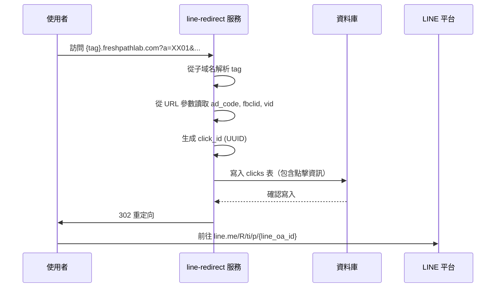

> **TL;DR**: 本文件整理了 `line-redirect` 服務與 LINE 官方帳號（LINE OA）的整合細節。核心內容：(1) `AD_MAP` 定義了 19 個 tag 對應的 LINE OA ID（如 `js→@935bicyi` 爆分王九州、`bf→@820rvxrp` 博富、`n22→@659jgxlp` 阿奇說球）；(2) 所有 LINE OA 的 Webhook 統一指向 `https://n8n.bexnua.store/webhook/line-follow`；(3) 子域名格式為 `{tag}.freshpathlab.com`，共 23 個子域名；(4) 跳轉流程六步：接收請求 → 解析 tag → 解析 URL 參數（ad_code/fbclid/vid）→ 生成 click_id (UUID) → 寫入 D1 clicks 表（42 欄位）→ 302 重定向至 `line.me/R/ti/p/{line_oa_id}`。2026-03-25 已驗證 LINE Messaging API 端點未變。

# LINE 官方帳號與 Webhook 整合說明

> **驗證狀態**：2026-03-25 已驗證。LINE Messaging API 端點未變，本專案使用的跳轉與 Webhook 追蹤功能不受影響。 [已過期：LINE Notify 已於 2025-03-31 停用，但本專案未使用此功能]。

本文件旨在整理 `line-redirect` 服務與 LINE 官方帳號（LINE OA）之間的整合細節，包含帳號對應、Webhook 設定、域名規則及跳轉流程。

---

## 一、LINE 官方帳號對應表

<rule id="tag-to-oa-mapping">

`line-redirect` 服務中的 `AD_MAP` 常數定義了廣告活動標籤（tag）與對應的 LINE 官方帳號 ID。此對應關係是實現正確跳轉的基礎。

| Tag | LINE OA ID | 名稱 | 產品線 |
| :--- | :--- | :--- | :--- |
| js | @935bicyi | 爆分王-九州體育 | 爆分王（AS） |
| cs | @999hqlmk | 爆分王-電子訊號程式 | 爆分王（AS） |
| ms | @460pnxwi | 爆分王-真人百家樂 | 爆分王（AS） |
| ls | @038vgxhj | 爆分王-體育分析程式 | 爆分王（AS） |
| jb | @684ynxwj | 莊家剋星-九州體育 | 莊家剋星（AB） |
| cb | @684ynxwj | 莊家剋星-電子 | 莊家剋星（AB） |
| mb | @684ynxwj | 莊家剋星-真人 | 莊家剋星（AB） |
| lb | @684ynxwj | 莊家剋星-體育 | 莊家剋星（AB） |
| jx | @591xhwdp | 獨角仙-九州 | 獨角仙（AX） |
| cx | @591xhwdp | 獨角仙-電子 | 獨角仙（AX） |
| mx | @591xhwdp | 獨角仙-真人 | 獨角仙（AX） |
| lx | @591xhwdp | 獨角仙-體育 | 獨角仙（AX） |
| bf | @820rvxrp | 博富 | 博富（BF） |
| jd | @jd_line | — | [待確認] |
| n14 | @n14_line | — | [待確認] |
| n18 | @n18_line | — | [待確認] |
| n20 | @n20_line | — | [待確認] |
| n22 | @659jgxlp | 阿奇說球 | — |
| sz | @sz_line | — | [待確認] |

> **注意**：部分 LINE OA ID 為根據 `line_config` 表的推測值，應以生產環境資料庫為最終依據。

</rule>

---

## 二、Webhook 設定

<rule id="webhook-url">

為了追蹤用戶加入好友的事件，所有 LINE 官方帳號的 Webhook 必須統一指向 n8n 自動化流程的端點。

- **Webhook URL**: `https://n8n.bexnua.store/webhook/line-follow`
- **Use webhook**: `Enabled`

</rule>

<example id="webhook-verify">

### 驗證範例：@659jgxlp（阿奇說球）

- **驗證時間**：2026-03-25
- **Webhook URL**：`https://n8n.bexnua.store/webhook/line-follow`
- **Use webhook**：Enabled
- **驗證結果**：Success

</example>

---

## 三、子域名規則

<rule id="subdomain-mapping">

`line-redirect` 服務綁定了 23 個子域名，每個子域名對應一個廣告活動標籤（tag），用於識別流量來源。

- **域名格式**: `{tag}.freshpathlab.com`
- **對應標籤**: `js`, `cs`, `ms`, `ls`, `jx`, `cx`, `mx`, `lx`, `jb`, `cb`, `mb`, `lb`, `bf`, `jd`, `n14`, `n18`, `n20`, `n22`, `sz` 等。

</rule>

---

## 四、LINE 跳轉處理流程

以下為使用者點擊廣告連結後，系統處理跳轉的完整步驟：

<step id="request-received">**1. 接收請求**：`line-redirect` 服務收到來自 `{tag}.freshpathlab.com` 的請求。</step>
<step id="parse-tag">**2. 解析標籤**：從請求的子域名中解析出對應的 `tag`。</step>
<step id="parse-params">**3. 解析參數**：從 URL 查詢參數中讀取 `ad_code`、`fbclid`、`vid` 等追蹤碼。</step>
<step id="generate-click-id">**4. 生成點擊 ID**：為此次點擊生成一個唯一的 `click_id` (UUID)。</step>
<step id="write-to-db">**5. 記錄點擊**：將 `tag`、追蹤參數、`click_id` 等共 42 個欄位的資訊寫入資料庫的 `clicks` 表。</step>
<step id="redirect-to-line">**6. 重定向至 LINE**：根據 `tag` 查詢到對應的 LINE OA ID，並將使用者 302 重定向至 LINE 加好友頁面。</step>

<rule id="line-add-friend-url">

LINE 加好友的 URL 格式固定為：`https://line.me/R/ti/p/{line_oa_id}`

</rule>

---

## 五、結論與後續步驟

此文件確立了 LINE 整合的核心機制，確保廣告流量能被正確地引導至對應的官方帳號，並完成點擊追蹤。為了維持系統穩定，任何對 LINE 帳號、`line-redirect` 服務或 n8n Webhook 的變更，都應同步更新此文件。

---

## 相關文件

| 文件 | 關係 |
| :--- | :--- |
| [cloak-admin-n8n-workflow.md](cloak-admin-n8n-workflow.md) | N8N 工作流配置（含 Time Attribution） |
| [cloak-admin-e2e-cmd.md](../../09-歸檔/03-專案/斗篷管理後台/cloak-admin-e2e-cmd.md) | 端對端測試 SOP（含 LINE Follow 模擬）（已歸檔） |
| [上帝視角 LINE 配置規範](../上帝視角/godview-line-config-spec.md) | D1 line_config 表維護規則 |
