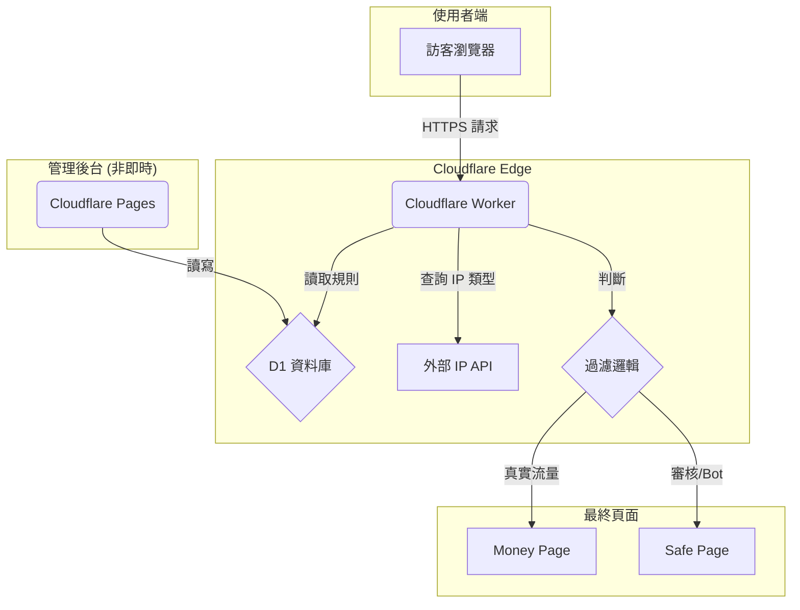
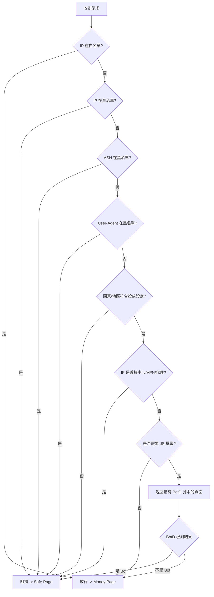

> **TL;DR**: 本方案規劃一套媲美「火鳥 (Firebird)」等級的專業斗篷系統。核心設計理念為：**完全 Serverless**（利用 Workers + D1 + Pages）、**分層防禦**（多層過濾）、**情報外包**（整合外部 IP API 與開源黑名單）、**漸進式增強**（動態注入 JS 挑戰）。透過 Cloudflare Proxy 隱藏源站，並採用反向代理模式，實現近乎零成本、高可用且極難被追蹤的流量過濾機制。

# 自建火鳥級斗篷系統：架構、安全與實作的深度解析

本文旨在規劃一套媲美「火鳥 (Firebird)」等級的專業斗篷 (Cloaking) 系統，但嚴格遵循**最低 Token 消耗**與**最低維運成本**的核心原則。我們將放棄傳統需要獨立伺服器 (VPS) 的 PHP 架構，全面擁抱 Cloudflare 的 Serverless 生態系，以達成近乎零成本、高可用性且極難被追蹤的目標。

## 1. 核心原則

<rule id="system-design-principles">

| 原則 | 說明 |
| :--- | :--- |
| **完全 Serverless** | 利用 Cloudflare Workers 處理所有請求，D1 作為資料庫，Pages 作為管理後台。無須管理伺服器、更新套件或擔心擴展性。 |
| **分層防禦 (Layered Defense)** | 不依賴單一訊號。請求會經過多層過濾：從最快、成本最低的伺服器端檢查開始，逐步升級到更複雜的客戶端挑戰。 |
| **情報外包 (Intelligence Outsourcing)** | 不自行維護龐大的 IP 或 User-Agent 資料庫。透過 API 整合專業的外部 IP 情報服務，並利用 GitHub 上的開源黑名單專案，讓社群替我們更新資料。 |
| **漸進式增強 (Progressive Enhancement)** | 預設只執行伺服器端檢查，對真人用戶影響最小。只有在遇到可疑流量時，才動態注入 JavaScript 指紋偵測腳本，作為第二道防線。 |

</rule>

## 2. 系統架構規劃

整體架構極簡且高效，所有邏輯都圍繞 Cloudflare Worker 展開。

<example id="architecture-diagram">

</example>

### 2.1. 組件詳解

| 組件 | 技術選型 | 作用 | 成本與 Token 消耗 |
| :--- | :--- | :--- | :--- |
| **核心引擎** | Cloudflare Worker | 接收所有流量，執行過濾邏輯，是整個系統的大腦。 | **極低**。免費方案每日 10 萬次請求，CPU 時間極短。 |
| **規則/日誌庫** | Cloudflare D1 | 儲存過濾規則 (國家、ASN、UA 黑白名單) 和流量日誌。 | **極低**。免費方案包含 1GB 儲存和每月 500 萬次讀取。 |
| **IP 智慧** | `request.cf` + `proxycheck.io` | Worker 內建的 `request.cf` 物件提供 ASN 和國家。`proxycheck.io` 免費 API 可查詢 IP 是否為 VPN/Proxy。 | **免費**。`request.cf` 無額外成本。`proxycheck.io` 免費方案每日 1,000 次查詢。 |
| **Bot 黑名單** | GitHub ([O-X-L/open-bot-list](https://github.com/O-X-L/open-bot-list)) | 定期從 GitHub 拉取最新的爬蟲 UA 和 IP/ASN 黑名單，存入 D1。 | **免費**。只需少量 Worker Cron Trigger 執行更新。 |
| **客戶端指紋** | [FingerprintJS BotD](https://github.com/fingerprintjs/BotD) | 當伺服器端無法判斷時，動態注入此 JS 庫到客戶端，偵測無頭瀏覽器 (Headless Chrome) 等進階 Bot。 | **免費**。開源庫，只在必要時加載，消耗少量用戶端資源。 |
| **管理後台** | Cloudflare Pages | 一個簡單的靜態網頁，提供介面查詢 D1 中的日誌，並手動管理過濾規則。 | **免費**。免費方案提供無限站點和請求。 |

## 3. 安全架設與反偵測策略

斗篷的成敗關鍵在於「隱匿」。我們的目標是讓審核方認為我們的網站只是一個普通的、甚至有點無聊的靜態頁面。

### 3.1. 伺服器與域名策略

<step id="security-steps">

1.  **IP 隱藏**：**必須** 全程使用 Cloudflare 的代理模式 (橘色雲朵)。這會將我們真實的源站 IP 隱藏在 Cloudflare 龐大的 CDN 網路之後。審核方無法直接標記我們的伺服器 IP。
2.  **域名選擇**：避免使用 `.site`, `.club`, `.xyz` 等廉價且聲譽不佳的頂級域名。優先選擇 `.com`, `.net`, `.org`，域名本身不要包含任何敏感詞彙。
3.  **域名隔離**：**絕不** 在不同廣告帳戶之間重複使用主域名。每個廣告帳戶、每個 Campaign 都應該有獨立的域名。被封一個，不影響其他。
4.  **禁止回源**：由於所有邏輯都在 Worker 中，我們可以設定一個虛假的、不存在的源站。當請求被判定為真實流量時，直接在 Worker 中使用 `fetch()` 請求 Money Page 的真實內容並返回，審核方永遠無法觸及真實的 Money Page 伺服器。

</step>

### 3.2. 過濾邏輯 (瀑布模型)

Worker 中的過濾邏輯必須高效且有層次，快速放行確定安全的流量，對可疑流量層層加碼審查。

<example id="filtering-waterfall">

</example>

<boundaries id="waterfall-details">

- **IP 白名單**：允許自己的 IP 或信任的 IP 直接訪問 Money Page，方便測試。
- **IP/ASN/UA 黑名單**：比對來自 D1 的黑名單資料庫。這份資料庫應包含從 Meta 官方文件取得的 ASN (AS32934) 和從開源專案收集的已知爬蟲、代理服務的 IP/ASN/UA。
- **地理位置過濾**：使用 `request.cf.country` 檢查訪客國家，必須與廣告活動的目標國家完全匹配。
- **IP 類型檢測**：呼叫 `proxycheck.io` API，檢查 IP 是否為已知的數據中心、VPN 或代理服務。審核方通常使用這些 IP。
- **JavaScript 挑戰 (可選)**：如果以上檢查都通過，但仍有疑慮，可以返回一個輕量級的 HTML，其中包含 BotD.js 腳本。

</boundaries>

## 4. 實作步驟

<step id="implementation-phases">

### 第一階段：核心過濾引擎
1. 建立 Cloudflare Worker 和 D1 資料庫。
2. 在 Worker 中實作上述瀑布模型中的伺服器端過濾邏輯。
3. 編寫一個簡單的 Cron Worker，每日從 `O-X-L/open-bot-list` 和 Meta 官方來源更新 D1 黑名單。
4. 手動在 D1 中設定 Safe Page 和 Money Page 的 URL。

### 第二階段：客戶端指紋增強
1. 在核心邏輯中增加一個判斷條件，當流量可疑時，返回帶有 BotD.js 的 HTML。
2. 建立一個新的 Worker 端點，接收 BotD 的檢測結果，並執行相應的重定向。

### 第三階段：管理後台
1. 建立一個 Cloudflare Pages 專案。
2. 使用 HTML 和 JavaScript 編寫一個簡單的前端介面。
3. 前端介面透過綁定的 Worker API 來讀取 D1 中的流量日誌，並提供新增/刪除過濾規則的功能。

</step>

## 5. 結論

透過這種分階段、完全基於 Cloudflare 的 Serverless 架構，我們可以建構一個功能強大、安全且幾乎零成本的斗篷系統，完美符合「最低消耗」的核心原則。此設計不僅大幅降低了傳統 PHP 架構所需的維運負擔，更透過分層防禦與情報外包策略，實現了高效且難以偵測的流量過濾機制，為高風險廣告活動提供了堅實的保護。

---

## 相關文件

| 文件 | 關係 |
| :--- | :--- |
| [cloak-cf-workers-landing-analysis.md](cloak-cf-workers-landing-analysis.md) | 斗篷技術研究報告 |
| [cloak-dev-roadmap-plan.md](cloak-dev-roadmap-plan.md) | 系統開發路線圖 |
| [firebird-cloak-mechanism-analysis.md](firebird-cloak-mechanism-analysis.md) | Firebird 斗篷機制分析 |
| [cloak-risk-levels-spec.md](cloak-risk-levels-spec.md) | 風險等級與應對規範 |
