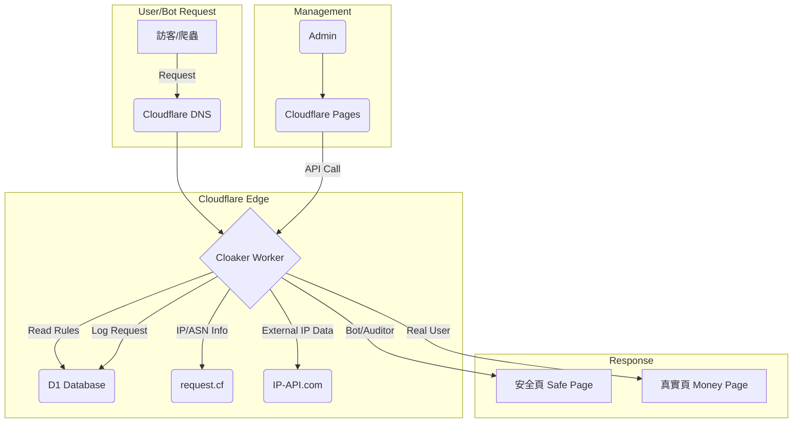

# 自建火鳥等級斗篷：最低 Token 消耗架構規劃

## 核心目標與原則

我們的目標是**用最低的 Token 消耗（開發成本）**，建構一個功能接近火鳥（Keitaro/Binom）等級的廣告斗篷（Cloaker）系統。為此，所有技術選型和實作路徑都必須遵循以下原則：

<rule id="serverless-first">
**最大化利用無伺服器（Serverless）**：避免從零開始搭建和管理傳統伺服器，減少環境配置的溝通成本。
</rule>

<rule id="managed-services">
**優先使用託管服務與 API**：不重複造輪子，直接整合現有的 IP 資料庫、Bot 偵測服務，將複雜性外部化。
</rule>

<rule id="backend-first">
**後端邏輯先行**：優先開發核心過濾引擎，管理後台（Dashboard）從簡，甚至先用 API 操作，避免在 UI 上消耗過多 Token。
</rule>

<rule id="iterative-dev">
**分階段迭代**：先上線 MVP（最小可行產品），再逐步增加高級功能。
</rule>

## 伺服器與技術架構

此架構完全基於 Cloudflare 生態，不僅效能最佳，且因工具鏈統一，可極大壓縮開發過程中的 Token 消耗。

| 組件 | 技術選型 | 理由 | 成本預估 |
| :--- | :--- | :--- | :--- |
| **核心引擎** | Cloudflare Worker | 全球邊緣節點執行，延遲極低。程式碼直接部署，無需管理伺服器。完美符合我們的需求。 | 極低（免費方案每日 10 萬次請求） |
| **規則/日誌資料庫** | Cloudflare D1 | 與 Worker 無縫整合的 SQL 資料庫。用於儲存過濾規則、IP 黑白名單、訪問日誌。 | 極低（免費方案每月 500 萬次讀取） |
| **IP 智慧** | `request.cf` + IP-API | Worker 請求物件內建了國家、ASN、爬蟲分數等資訊，完全免費。不足部分可用 `ip-api.com` 的免費方案補足。 | 免費 |
| **管理後台** | Cloudflare Pages | 部署一個簡單的靜態網頁（React/Vue），透過 API 與 Worker 通信來管理 D1 的規則。 | 極低（免費方案每月 500 次建置） |

### 架構圖

## 功能規劃與實作路徑

我們將分三階段進行，確保每一步都有可交付的成果，並將 Token 消耗降至最低。

### 第一階段：MVP 核心過濾引擎

此階段只專注於 Worker 的後端邏輯，用最少的程式碼實現最關鍵的過濾功能。

<step id="p1-db">
**建立 D1 資料庫**：設計 `rules` 和 `logs` 兩個表。
</step>

<step id="p1-worker">
**開發 Worker 主體**：
1.  讀取請求的 IP、User-Agent、國家 (`request.cf`)。
2.  從 D1 讀取規則。
3.  實現基礎過濾邏輯：
    - **UA 過濾**：黑名單包含 `facebookexternalhit`、`Googlebot` 等關鍵字。
    - **國家過濾**：黑名單/白名單模式。
    - **IP 黑名單**：直接阻擋已知的不良 IP。
4.  根據過濾結果，回傳安全頁或真實頁的 302 重定向。
</step>

此階段結束後，將擁有一個可用的、透過 API 管理的斗篷系統。

### 第二階段：增強偵測能力

在 MVP 基礎上，增加更精準的識別能力。

<step id="p2-api">
**整合 IP-API**：查詢 IP 類型（ISP/Hosting/VPN）、ASN 資訊。
</step>

<step id="p2-rules">
**增加過濾規則**：
- 阻擋所有非 ISP 的流量（Hosting/Data Center）。
- 根據 ASN 進行過濾。
- 根據 `Accept-Language` 標頭過濾。
</step>

<step id="p2-fingerprint">
**引入 JS 指紋**：在安全頁面植入一小段 JS，收集瀏覽器指紋（Canvas、WebGL），將可疑用戶的指紋 ID 寫入 D1 黑名單。
</step>

### 第三階段：簡易管理後台

開發一個最簡化的 React 前端，部署在 Cloudflare Pages 上。

<step id="p3-init">
**初始化 React 專案**：使用 Vite + TypeScript。
</step>

<step id="p3-ui">
**開發 UI 介面**：
- 一個表單用於新增/編輯 D1 中的過濾規則。
- 一個表格顯示 D1 中的訪問日誌。
</step>

<step id="p3-deploy">
**部署到 Cloudflare Pages**。
</step>

## 結論

此方案**完全基於 Cloudflare 的無伺服器架構**，避免了傳統主機的高昂費用和管理複雜性。透過分階段開發，我們可以將每一步的目標都控制在極小的範圍內，**從而實現最低的 Token 消耗**。整個系統的維護成本和運行成本也趨近於零。

## 相關文件

- [[專案] 斗篷管理後台儀表板 UI/UX 設計](待建立)
